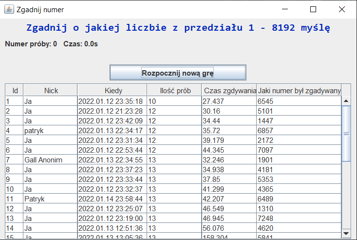

# Game: Guess Number
Game in which the player guesses the number that was drawn by the application.
The program was made to pass the Object-Oriented Programming (Programowanie Obiektowe) subject at Poznań University of Technology (Politechnika Poznańska) in threed term.

# Program Apperance

